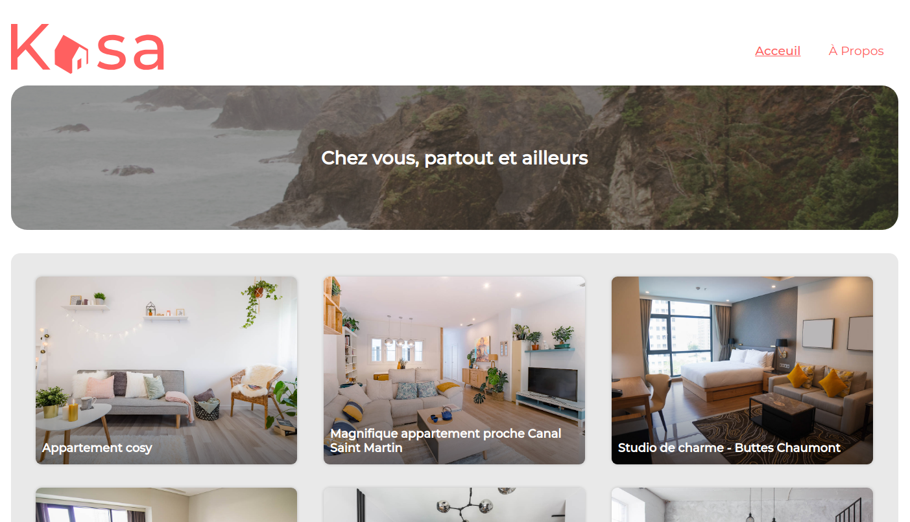

# Application web de location immobilière Kasa

Huitième projet du parcours "D'intégrateur web" chez OpenClassroom. L'objectif est de créez une application web dynamique, de location immobilière, avec React en front-end et JavaScript avec NodeJS en back-end.

Vous pouvez retrouver la maquette [ici](https://www.figma.com/file/qEno0LwL4ZLkWyeY59kxp1/UI-Design-Kasa-FR?node-id=0%3A1&mode=dev).

Et son prototype [la](https://www.figma.com/proto/qEno0LwL4ZLkWyeY59kxp1/UI-Design-Kasa-FR?type=design&node-id=3-0&scaling=scale-down-width&page-id=0%3A1&starting-point-node-id=3%3A0&show-proto-sidebar=1).

_Voici une capture d'écran du résultat de ma réalisation_



## Objectifs

Le site de Kasa a été codé il y a maintenant plus de 10 ans en ASP.NET avec un code legacy important. Laura, la CTO, a donc lancé une refonte totale pour passer à une stack complète en JavaScript avec NodeJS côté back-end, et React côté front-end. Kasa en a également profité pour commander de nouvelles maquettes auprès de son designer habituel, qui est en freelance. Un gros chantier pour cette année !

## Ma tache

Démarrer le projet React et développer l’ensemble de l’application, les composants React, les routes React Router, en suivant les maquettes Figma (responsives !), avec toutes les information Fournis.

Développer :

1. la page d'acceuil (à créer de zero) ;
2. la page de présentation du logement (code à créer de zéro) ;
3. la page à propos (code à créer aussi de zéro);
4. la page d'erreur 404 (code à créer aussi de zéro);
5. Le routeur et ses page de routes (code à créer de zéro);
6. l'Api (code à créer aussi de zéro mais un fichier json des 20 dernières annonces de logements est fournis).

## Livrables

### Pages à développer et intégrer selon les maquettes

- **Page d'accueil**
- **Page à propos**
- **Page du logement**
- **Page d'erreur 404**

### Développement

**Page d'accueil**

- **affichage d'une bannière**
- **affichage dynamiques des logements**

**Page à propos**

- **affichage d'une bannière**
- **affichage de collapseur pour chaque éléments**

**Page de présentation du logement**

- **Un caroussel des photos du logement**
- **Les informations sur le logement**
- **Photo de profil du loueur**
- **La notation sous forme d'icône d'étoiles**
- **Deux collapseurs qui auront pour titres description et équipements**

**Page d'erreur**

- **Page affichant un message d'erreur 404, dont le chiffre 404 en tres gros au milieu de la page**

**L'API fetch**

**Le routeur et ses pages de routings**

## Technologies

**Autorisés:** HTML / React / Sass / NodeJS

**Recommandée:** HTML / React / Javascript / NodeJS / ExpressJS

**Interdit:** Frameworks CSS / Inline CSS / coder en CSS / Frameworks React externe

## Notes

**Polices :**

- Logo, titres & textes: Montserrat

**Couleurs :**

- Primaire: #FF6060
- Secondaire: #F6F6F6
- Tertiaire: #FFFFFF

**Contraintes :**

- Maquette desktop : oui
- Maquette Mobile : oui
- Utilisation de NodeJS : oui
- Utilisation de React : obligatoire
- Utilisation de Create React App : obligatoire
- Utilisation de React Router : obligatoire
- Utilisation de Sass : Obligatoire
- Styling : Tout le style CSS doit être codé en utilisant Sass.
- Validation W3C HTML : pas obligatoire dans ce projet mais à passer de préférence, warning autorisés
- Validation W3C CSS : pas obligatoire dans ce projet mais à passer de préférence, warning autorisés
- Compatibilité : Dernières versions de Chrome, Firefox & Safari
- Général : Le code ne doit pas produire d'erreur ou de warning dans la console.

Contraintes fonctionnelles sur les fonctionnalités du site :

Pour le défilement des photos dans la galerie (composant Gallery) : - Si l'utilisateur se trouve à la première image et qu'il clique sur "Image précédente", la galerie affiche la dernière image. - Inversement, quand l'image affichée est la dernière de la galerie, si l'utilisateur clique sur "Image suivante", la galerie affiche la première image. - S'il n'y a qu'une seule image, les boutons "Suivant" et "Précédent" ainsi que la numérotation n'apparaissent pas.
La galerie doit toujours rester de la même hauteur, celle indiquée sur la maquette Figma. Les images seront donc coupées et centrées dans le cadre de l’image.
Collapse : Par défaut, les Collapses sont fermés à l'initialisation de la page.
Si le Collapse est ouvert, le clic de l'utilisateur permet de le fermer. - Inversement, si le Collapse est fermé, un clic permet de l'ouvrir.

- React : Il est impératif d’utiliser ces éléments de React pour un code de qualité :
  ● Découpage en composants modulaires et réutilisables ;
  ● Un composant par fichier ;
  ● Structure logique des différents fichiers ;
  ● Utilisation des props entre les composants ;
  ● Utilisation du state dans les composants quand c'est nécessaire ;
  ● Gestion des événements ;
  ● Listes : React permet de faire des choses vraiment intéressantes avec les listes, en itérant dessus, par exemple
  avec map. Il faut les utiliser autant que possible. Il est également recommandé, mais pas imposé,
  d’utiliser des composants fonctionnels plutôt que des composants classes.

- Routing :
  ● Les paramètres des routes sont gérés par React Router dans l'URL pour récupérer les informations de chaque logement.
  ● Il existe une page par route.
  ● La page 404 est renvoyée pour chaque route inexistante, ou si une valeur présente dans l’URL ne fait pas partie des
  données renseignées.
  ● La logique du routeur est réunie dans un seul fichier.

## Convention nommage commit

Gitmoji https://gitmoji.dev/

## Tester le projet

Pour tester simplement & rapidement, je vous invite à cloner le project.

clonez le projet :

```terminal
git clone https://github.com/Aeron01/OC-Project-8-KASA.git
```

Et lancez le serveur !

```terminal
npm start
```
